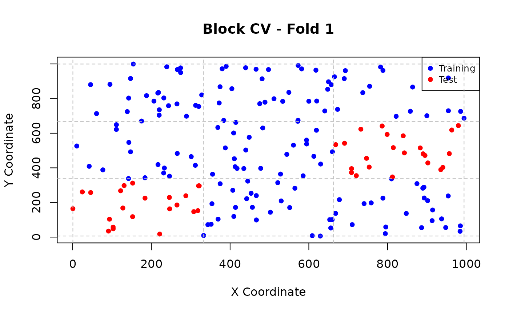
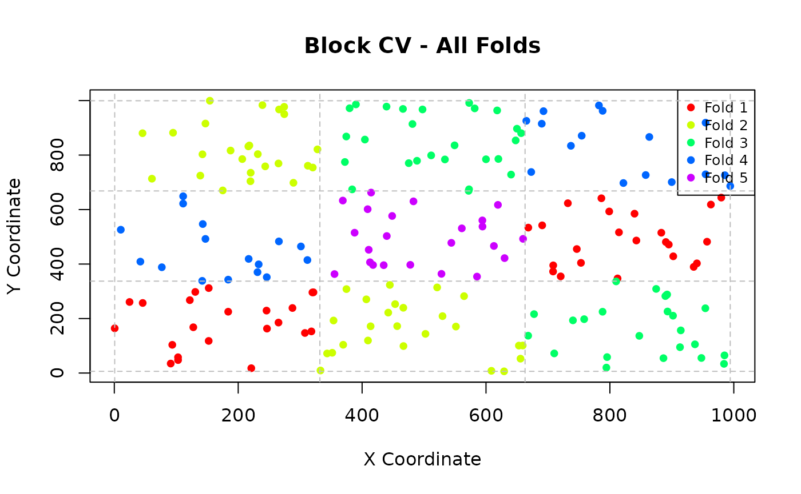

# Spatial Cross-Validation Methods

## Overview

This vignette demonstrates the different spatial cross-validation
methods available in `spatialcvR` and when to use each approach.

## Available Methods

`spatialcvR` implements four main spatial cross-validation methods:

1.  **Spatial Block CV**: Divide space into rectangular blocks
2.  **Buffered CV**: Exclude training observations within a buffer
    radius
3.  **Spatial Clustering CV**: Group observations spatially using
    clustering
4.  **Random Split**: Baseline random CV for comparison

## Setup

``` r

library(spatialcvR)

# Load sample data
data(sample_spatial_data)
head(sample_spatial_data)
```

    ##   id longitude latitude variable1 variable2    target
    ## 1  1  287.5775 238.7260  86.36698  36.57333 110.40061
    ## 2  2  788.3051 962.3589 102.53939  49.52156 143.78578
    ## 3  3  408.9769 601.3657  67.79740  42.96299 101.66984
    ## 4  4  883.0174 515.0297  99.58281  45.22016 123.82676
    ## 5  5  940.4673 402.5733  92.87996  47.44277 129.43342
    ## 6  6   45.5565 880.2465  47.51536  43.20302  86.62062

## Spatial Block Cross-Validation

### Concept

Spatial block CV divides the study area into a grid of rectangular
blocks. Observations are assigned to folds based on which block they
fall into. This ensures spatial separation between training and test
sets.

### When to Use

- Data with relatively uniform spatial distribution
- When you want to ensure geographic coverage
- When computational efficiency is important
- As a default spatial CV method

### Basic Usage

``` r

# Create spatial block folds
folds_block <- spatial_folds(
  data = sample_spatial_data,
  x = "longitude",
  y = "latitude",
  k = 5,
  method = "block",
  seed = 123
)

print(folds_block)
```

    ## Spatial Cross-Validation Folds
    ## ==============================
    ## Method: spatial_block 
    ## Number of folds: 5 
    ## Observations: 200 
    ## CRS: Not defined 
    ## Has duplicate coordinates: FALSE 
    ## Seed: 123 
    ## 
    ## Fold sizes:
    ##   Fold 1: 155 train, 45 test
    ##   Fold 2: 150 train, 50 test
    ##   Fold 3: 150 train, 50 test
    ##   Fold 4: 168 train, 32 test
    ##   Fold 5: 177 train, 23 test

### Controlling Block Size

You can control the spatial resolution using either block size or number
of blocks:

``` r

# Specify block size
folds_block_size <- spatial_block_folds(
  data = sample_spatial_data,
  x = "longitude",
  y = "latitude",
  k = 5,
  block_size = c(200, 200),  # 200x200 unit blocks
  seed = 123
)

# Specify number of blocks
folds_n_blocks <- spatial_block_folds(
  data = sample_spatial_data,
  x = "longitude",
  y = "latitude",
  k = 5,
  n_blocks = c(5, 5),  # 5x5 grid
  seed = 123
)
```

### Assignment Strategies

Blocks can be assigned to folds using different strategies:

``` r

# Systematic assignment (default)
folds_systematic <- spatial_block_folds(
  data = sample_spatial_data,
  x = "longitude",
  y = "latitude",
  k = 5,
  assignment = "systematic",
  seed = 123
)

# Random assignment
folds_random_assign <- spatial_block_folds(
  data = sample_spatial_data,
  x = "longitude",
  y = "latitude",
  k = 5,
  assignment = "random",
  seed = 123
)
```

## Buffered Cross-Validation

### Concept

Buffered CV ensures that for each test observation, no training
observation falls within a specified buffer radius. This provides strict
control over the minimum spatial separation.

### When to Use

- When you need precise control over train/test distance
- For point-based data with irregular sampling
- When buffer distance has ecological/physical meaning
- For conservative performance estimates

### Basic Usage

``` r

# Create buffered folds
folds_buffer <- spatial_buffer_folds(
  data = sample_spatial_data,
  x = "longitude",
  y = "latitude",
  k = 5,
  buffer_radius = 100,  # 100 unit buffer
  seed = 123
)

print(folds_buffer)
```

    ## Spatial Cross-Validation Folds
    ## ==============================
    ## Method: spatial_buffer 
    ## Number of folds: 5 
    ## Observations: 
    ## CRS:  
    ## Has duplicate coordinates: 
    ## 
    ## Fold sizes:
    ##   Fold 1: 160 train, 40 test
    ##   Fold 2: 160 train, 40 test
    ##   Fold 3: 160 train, 40 test
    ##   Fold 4: 160 train, 40 test
    ##   Fold 5: 160 train, 40 test

### Important Notes

- Buffered CV requires a **projected CRS** for accurate distance
  calculations
- Using geographic coordinates (longitude/latitude) will produce
  approximate distances
- Larger buffer radii reduce the size of training sets
- This method is computationally more intensive than block CV

## Spatial Clustering Cross-Validation

### Concept

Spatial clustering CV groups spatially proximate observations using
clustering algorithms (k-means), then assigns clusters to folds. This is
useful for data with complex spatial structure.

### When to Use

- Data with irregular or clustered spatial patterns
- When natural spatial groupings exist
- For heterogeneous spatial distributions
- When block boundaries would be arbitrary

### Basic Usage

``` r

# Create clustering folds
folds_cluster <- spatial_cluster_folds(
  data = sample_spatial_data,
  x = "longitude",
  y = "latitude",
  k = 5,
  n_clusters = 10,  # Number of spatial clusters
  seed = 123
)

print(folds_cluster)
```

    ## Spatial Cross-Validation Folds
    ## ==============================
    ## Method: spatial_cluster 
    ## Number of folds: 5 
    ## Observations: 
    ## CRS:  
    ## Has duplicate coordinates: 
    ## 
    ## Fold sizes:
    ##   Fold 1: 143 train, 57 test
    ##   Fold 2: 173 train, 27 test
    ##   Fold 3: 161 train, 39 test
    ##   Fold 4: 158 train, 42 test
    ##   Fold 5: 165 train, 35 test

### Understanding Cluster Assignment

``` r

# Examine cluster centers
folds_cluster$parameters$cluster_centers
```

    ##    x_coords y_coords
    ## 1  532.7197 565.9710
    ## 2  887.9961 696.9285
    ## 3  434.2980 318.7487
    ## 4  233.6940 125.0067
    ## 5  148.7116 397.2902
    ## 6  608.2099 878.5329
    ## 7  843.4232 400.2357
    ## 8  886.7498 125.1667
    ## 9  619.4220 116.1783
    ## 10 235.5819 827.2978

## Random Spatial Split (Baseline)

### Concept

Random spatial split performs standard random k-fold cross-validation
without spatial constraints. This serves as a baseline to demonstrate
the impact of spatial dependence.

### When to Use

- As a baseline for comparison
- When spatial dependence is minimal
- For initial exploratory analysis
- To demonstrate the value of spatial CV

### Basic Usage

``` r

# Create random folds
folds_random <- spatial_split(
  data = sample_spatial_data,
  x = "longitude",
  y = "latitude",
  k = 5,
  seed = 123
)

print(folds_random)
```

    ## Spatial Cross-Validation Folds
    ## ==============================
    ## Method: random 
    ## Number of folds: 5 
    ## Observations: 
    ## CRS:  
    ## Has duplicate coordinates: 
    ## 
    ## Fold sizes:
    ##   Fold 1: 160 train, 40 test
    ##   Fold 2: 160 train, 40 test
    ##   Fold 3: 160 train, 40 test
    ##   Fold 4: 160 train, 40 test
    ##   Fold 5: 160 train, 40 test

## Choosing the Right Method

### Decision Flowchart

1.  **Start with spatial block CV** - Good default choice
2.  **Need precise distance control?** → Use buffered CV
3.  **Complex spatial patterns?** → Use clustering CV
4.  **Compare with random CV** → Always include baseline

### Method Comparison

| Method | Pros | Cons | Best For |
|----|----|----|----|
| Block CV | Fast, intuitive, geographic coverage | May split natural clusters | Most cases |
| Buffered CV | Precise distance control | Computationally intensive | Point data, strict requirements |
| Clustering CV | Handles complex patterns | Sensitive to cluster parameters | Heterogeneous data |
| Random CV | Fast, baseline | No spatial control | Comparison, minimal spatial dependence |

## Visualizing Folds

``` r

# Plot individual fold
plot_spatial_folds(folds_block, sample_spatial_data, "longitude", "latitude", 
                   fold = 1, main = "Block CV - Fold 1")
```



``` r

# Plot all folds
plot_spatial_folds(folds_block, sample_spatial_data, "longitude", "latitude", 
                   fold = "all", main = "Block CV - All Folds")
```



## Practical Tips

### Start Simple

Begin with spatial block CV using default parameters:

``` r

# Default spatial block CV
folds_default <- spatial_folds(
  data = sample_spatial_data,
  x = "longitude",
  y = "latitude",
  k = 5
)
```

### Adjust Based on Data Characteristics

- **Dense data**: Use larger blocks or more clusters
- **Sparse data**: Use smaller blocks or fewer clusters
- **Strong spatial patterns**: Consider clustering CV
- **Precise distance requirements**: Use buffered CV

### Always Compare with Random CV

``` r

# Compare spatial vs random
folds_spatial <- spatial_folds(sample_spatial_data, "longitude", "latitude", 
                               k = 5, method = "block", seed = 123)
folds_random <- spatial_folds(sample_spatial_data, "longitude", "latitude", 
                             k = 5, method = "random", seed = 123)

# Analyze spatial leakage for both
leakage_spatial <- detect_spatial_leakage(sample_spatial_data, folds_spatial, 
                                           "longitude", "latitude")
leakage_random <- detect_spatial_leakage(sample_spatial_data, folds_random, 
                                          "longitude", "latitude")

print(leakage_spatial)
```

    ## Spatial Leakage Detection
    ## =========================
    ## Method: spatial_block 
    ## Overall Risk Level: LOW 
    ## Distance Threshold: 53.04 
    ## 
    ## Summary Statistics:
    ##   Min distance: 11.24
    ##   Mean distance: 521.24
    ##   Median distance: 530.91
    ##   Proportion below threshold: 0.1%
    ## 
    ## Fold Analysis:
    ##   Fold 1: LOW risk (0.1% below threshold)
    ##   Fold 2: LOW risk (0.0% below threshold)
    ##   Fold 3: LOW risk (0.1% below threshold)
    ##   Fold 4: LOW risk (0.2% below threshold)
    ##   Fold 5: LOW risk (0.1% below threshold)
    ## 
    ## Recommendations:
    ##   - Spatial separation appears adequate. 
    ##   - Current cross-validation setup should provide reliable performance estimates. 
    ##   - Consider increasing spatial separation if you need more conservative estimates.

``` r

print(leakage_random)
```

    ## Spatial Leakage Detection
    ## =========================
    ## Method: random 
    ## Overall Risk Level: LOW 
    ## Distance Threshold: 51.27 
    ## 
    ## Summary Statistics:
    ##   Min distance: 2.21
    ##   Mean distance: 512.67
    ##   Median distance: 504.43
    ##   Proportion below threshold: 0.8%
    ## 
    ## Fold Analysis:
    ##   Fold 1: LOW risk (0.7% below threshold)
    ##   Fold 2: LOW risk (0.8% below threshold)
    ##   Fold 3: LOW risk (0.8% below threshold)
    ##   Fold 4: LOW risk (0.7% below threshold)
    ##   Fold 5: LOW risk (0.8% below threshold)
    ## 
    ## Recommendations:
    ##   - Spatial separation appears adequate. 
    ##   - Current cross-validation setup should provide reliable performance estimates. 
    ##   - Consider increasing spatial separation if you need more conservative estimates.

## Common Issues and Solutions

### Issue: Too few observations per fold

**Solution**: Reduce k or use fewer blocks/clusters

``` r

# Reduce number of folds
folds_k3 <- spatial_folds(sample_spatial_data, "longitude", "latitude", k = 3)
```

### Issue: Uneven fold sizes

**Solution**: This is normal for spatial methods; consider using
stratified approaches if class imbalance is severe

### Issue: Geographic gaps in training data

**Solution**: Increase block size or number of clusters to improve
coverage

## Next Steps

- Learn about [spatial leakage
  detection](https://sowsalim01.github.io/spatialcvR/articles/spatial-leakage.md)
- Explore [model evaluation and
  comparison](https://sowsalim01.github.io/spatialcvR/articles/model-evaluation.md)

## Key Takeaways

1.  **Spatial block CV** is a good default method for most cases
2.  **Buffered CV** provides precise distance control when needed
3.  **Clustering CV** handles complex spatial patterns
4.  **Always compare** with random CV to assess spatial dependence
    impact
5.  **Visualize folds** to understand spatial separation
